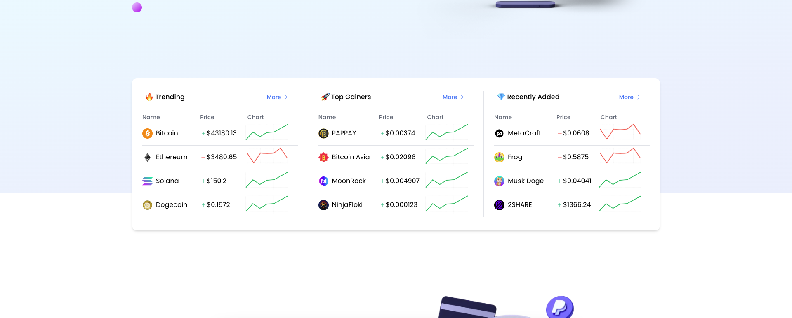
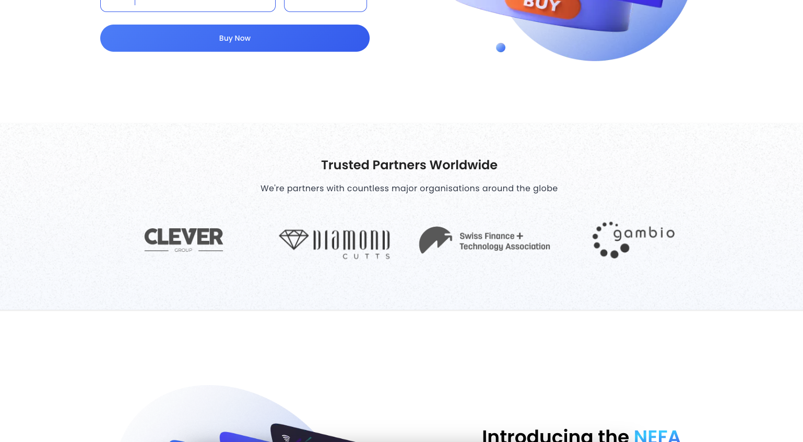
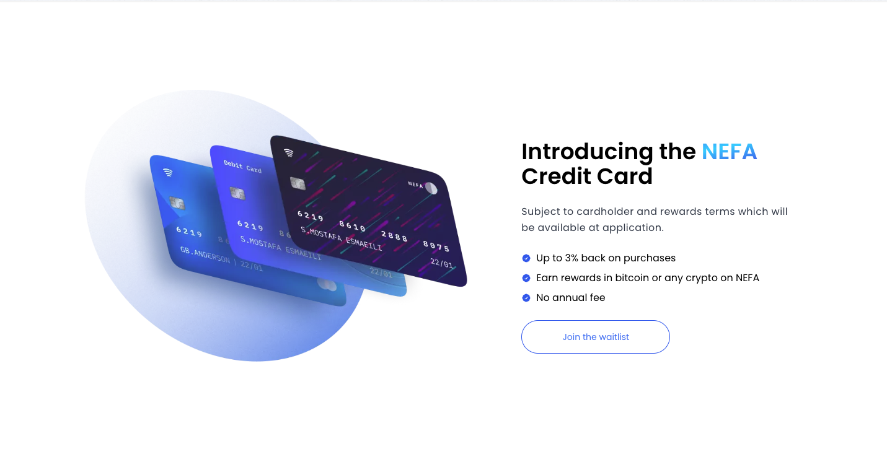
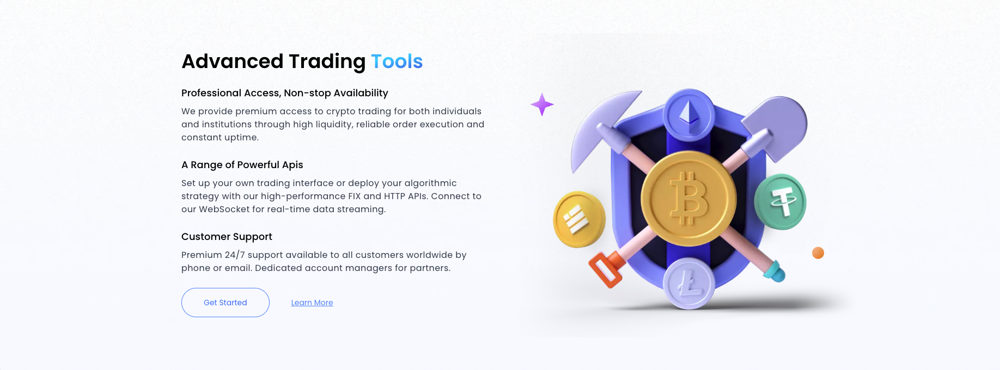
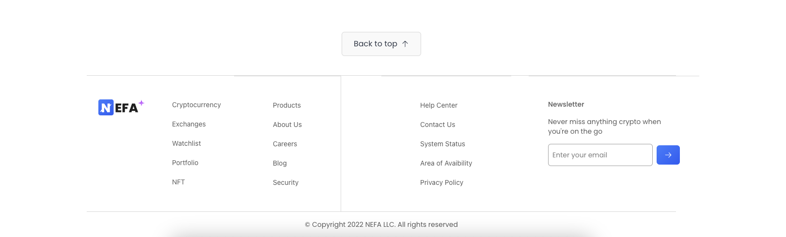

# NEFA Landing Page

## About this project 👨‍💻

The NEFA Landing Template is a modern and sleek landing page template created using a combination of React, TypeScript, and Aos (Animate on Scroll) library. It offers a visually appealing and interactive design that is perfect for showcasing products, services, or any other promotional content.

## Tech stack

- react
- aos
- typescript
- tailwind css

## Demo 

Website: [Live Demo](https://nefacrypto.vercel.app/)
Design: [Dribble](https://dribbble.com/shots/17267071-NEFA-Cryptocurrency-Exchange-Website)

- Hero

- Mobile

- Charts

- Exchange

- Partners

- Credit Card

- Tools

- Security

- Get Started

- FAQ

- Footer

